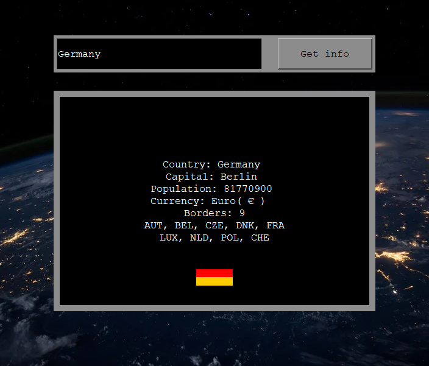

# InfoWorld

This is my first GUI - project with python and I did this because I wanted to learn how python gui works, and to understand basics of making applications.

InfoWorld:

* Is an application that tells country information about the country that user inputs.
* Shows country flags
* Uses 2 open APIs to get information
* Shows how basics of tkinter works

## Usage

Simply download the source folder and the code is explained on the .py file.
Then you need to install some libraries with pyinstall:

## Pip install libraries

* Python 3 needs to be installed (You can download it from the official site of python.)
* tkinter (import tkinter as tk) (from tkinter import font) (This should be installed by deafult, but if somehow is not, reinstall python.)
* Pip install Pillow (from PIL import ImageTk, Image)
* Pip install requests (import requests)
* BytesIO (from io import BytesIO)

## Visualization

## News

## Ghange log

## Sources
* Earth.jpg is from bixabay, where you can find cool and trademark free pictures for almost everything.

## Authors
* Niclas Ekman
